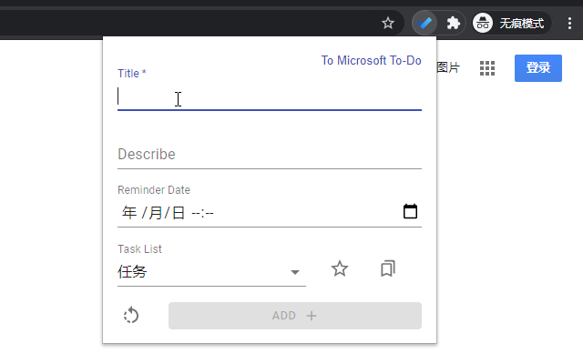

# Microsoft To Do browser extension

Microsoft To Do 浏览器扩展（[Chrome](https://chrome.google.com/webstore/detail/microsoft-to-do-chrome-ex/ffpljgmbiankjaokoefefmkoghcgoodn)、~~Firefox~~）

基于 [Microsoft Graph To Do API](https://docs.microsoft.com/en-us/graph/todo-concept-overview) 提供的能力；

使用 [React](https://reactjs.org/)、
[Material-UI](https://material-ui.com/)，通过 [Webpack](https://webpack.js.org/) 构建；

